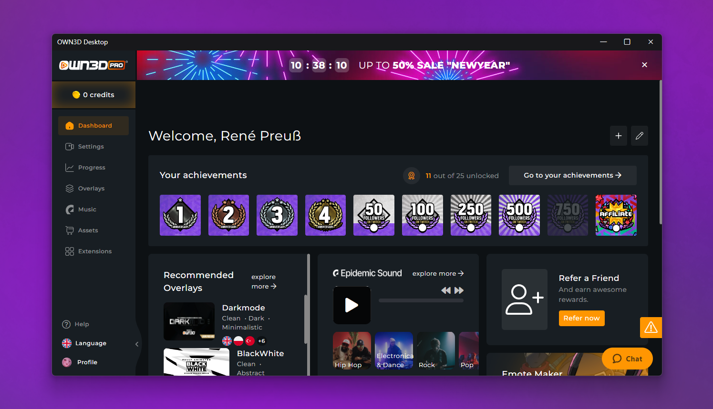

# OWN3D Desktop

## Introduction

The OWN3D Desktop app is a desktop client for OWN3D. It is built with Electron.

## Features

- Access to all of your OWN3D account features
- Essential tools to assist your streaming career
- Enhanced music player integration
- Look and feel like a native app

## Installation

To install the OWN3D Desktop app, simply download the latest release from our [releases page](https://github.com/own3d/desktop/releases/latest).

Once downloaded, double-click the OWN3D.Desktop-X.X.X.Setup.exe` file to begin the installation process.

## Usage

Once installed, launch the OWN3D Desktop app and log in using your Twitch or OWN3D credentials.

From here you can access all of your OWN3D account features and essential tools to assist your streaming career.

## Known Issues

- At this time, the OWN3D Desktop app cannot be toggled off from auto-starting when Windows starts up.

## Support

If you have any questions or issues with the OWN3D Desktop app, please [reach out to our support team](https://www.own3d.tv/contact).
